# PayMyBuddy
# PayMyBuddy — Pipeline CI/CD Jenkins

Mise en place d'un pipeline CI/CD complet pour l'application **PayMyBuddy** (Spring Boot) avec Jenkins, 
Docker, SonarCloud et déploiement automatisé sur AWS EC2.

---

## Table des matières

- [Architecture globale](#architecture-globale)
- [Stack technique](#stack-technique)
- [Pipeline CI/CD](#pipeline-cicd)
- [Déclenchement automatique via Webhook + Ngrok](#déclenchement-automatique-via-webhook--ngrok)
- [Déploiement](#déploiement)
- [Sécurité & Credentials](#sécurité--credentials)
- [Résultats](#résultats)

---

## Architecture globale

Le projet repose sur une architecture composée de :

- Un serveur **Jenkins** (AWS EC2) qui orchestre le pipeline
- Un serveur **Staging** (AWS EC2) pour les tests de validation
- Un serveur **Production** (AWS EC2) pour l'environnement final
- **DockerHub** comme registry d'images Docker
- **SonarCloud** pour l'analyse de la qualité du code
- **GitHub** comme gestionnaire de code source avec webhook
- **Ngrok** pour exposer Jenkins à Internet et recevoir les webhooks GitHub

---

## Stack technique

| Outil | Rôle |
|---|---|
| Jenkins | Orchestration du pipeline CI/CD |
| Docker | Conteneurisation de l'application et des agents |
| Maven | Build et tests de l'application Spring Boot |
| SonarCloud | Analyse statique de la qualité du code |
| DockerHub | Registry d'images Docker |
| MySQL 8.0 | Base de données de l'application |
| AWS EC2 | Hébergement des serveurs Jenkins, Staging et Prod |
| GitHub | Gestion du code source |
| Ngrok | Tunnel HTTP pour l'exposition de Jenkins |
| Slack | Notifications du pipeline |

---

## Pipeline CI/CD

Le pipeline suit le modèle **Gitflow** :
- Branche `main` → pipeline complet (CI + CD)
- Autres branches → pipeline partiel (CI uniquement, sans déploiement)

### Stages du pipeline

| # | Stage | Description |
|---|---|---|
| 1 | **Clean Workspace** | Nettoyage de l'espace de travail Jenkins |
| 2 | **Tests** | Exécution des tests unitaires avec Maven |
| 3 | **Code Quality** | Analyse SonarCloud (bugs, vulnérabilités, code smells) |
| 4 | **Quality Gate** | Validation du seuil de qualité SonarCloud |
| 5 | **Build** | Packaging de l'application en `.jar` |
| 6 | **Build & Push Docker Image** | Construction et push de l'image sur DockerHub |
| 7 | **Deploy Staging** | Déploiement sur le serveur de staging via SSH |
| 8 | **Test Staging** | Vérification HTTP de la disponibilité de l'application |
| 9 | **Deploy Prod** | Déploiement sur le serveur de production via SSH |
| 10 | **Test Prod** | Vérification HTTP de la disponibilité de l'application |

### Notifications Slack

À chaque fin de pipeline, une notification Slack est envoyée selon le résultat :

| Statut | Couleur | Emoji |
|---|---|---|
| SUCCESS | 🟢 Vert | ✅ |
| FAILURE | 🔴 Rouge | ❌ |
| UNSTABLE | 🟠 Orange | ⚠️ |


---

## Déclenchement automatique via Webhook + Ngrok

### Problématique

Jenkins est hébergé sur une instance AWS EC2 avec une IP privée non accessible depuis Internet. 
GitHub ne peut donc pas envoyer directement des webhooks à Jenkins.

### Solution : Ngrok

**Ngrok** est un outil qui crée un **tunnel sécurisé** entre Internet et un serveur local/privé. 
Il expose Jenkins via une URL publique temporaire.

### Fonctionnement

```
GitHub push → Webhook → URL Ngrok publique → Tunnel → Jenkins (EC2 privé)
```

1. Ngrok est lancé sur le serveur Jenkins :
```bash
ngrok http 8080
```

2. Ngrok génère une URL publique du type :
```
https://xxxx-xx-xx-xx-xx.ngrok-free.app
```

3. Cette URL est configurée comme **Webhook** dans GitHub :
   - **GitHub → Repository → Settings → Webhooks → Add webhook**
   - Payload URL : `https://xxxx.ngrok-free.app/github-webhook/`
   - Content type : `application/json`
   - Trigger : `Just the push event`

4. À chaque `git push` sur le repository, GitHub envoie une requête à l'URL Ngrok qui la transmet à Jenkins, déclenchant automatiquement le pipeline.

---

## Déploiement

### Architecture des conteneurs sur les serveurs

Chaque serveur (Staging et Prod) exécute deux conteneurs sur un réseau Docker dédié :

```
app-network
├── mysql-db (MySQL 8.0) — port 3306 interne
│   └── volume mysql-data (persistance des données)
└── paymybuddy (Spring Boot) — port 80:8080
    └── connexion jdbc://mysql-db:3306/db_paymybuddy
```

### Initialisation de la base de données

Le script SQL `create.sql` est copié sur le serveur et monté dans `/docker-entrypoint-initdb.d/` de MySQL, 
ce qui déclenche son exécution automatique au premier démarrage du conteneur.

### Validation du déploiement

Après chaque déploiement, un test HTTP vérifie que l'application répond :
- Code `200` (OK) ou `302` (redirect vers la page de login) → ✅ succès
- Autre code → ❌ échec du pipeline

---

## Sécurité & Credentials

Toutes les informations sensibles sont gérées via le **gestionnaire de credentials Jenkins** et ne sont jamais exposées dans le code :

| Credential ID | Type | Usage |
|---|---|---|
| `DOCKERHUB_AUTH` | Username/Password | Authentification DockerHub |
| `SSH_AUTH_STAGING` | SSH Key | Connexion SSH serveur staging |
| `SSH_AUTH_PROD` | SSH Key | Connexion SSH serveur prod |
| `jenkins-sonar` | Secret text | Token SonarCloud |
| `MYSQL_ROOT_PASSWORD` | Secret text | Mot de passe root MySQL |
| `Token_slack_jenkins` | Secret text | Token webhook Slack |

---

## Résultats

### SonarCloud — Quality Gate

### Pipeline complet SUCCESS

### Application accessible en Staging et Prod

### Illustrations  ############

<p align="center">
  
</p>


<p align="center">
  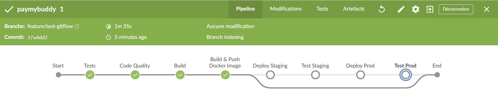
</p>

<p align="center">
  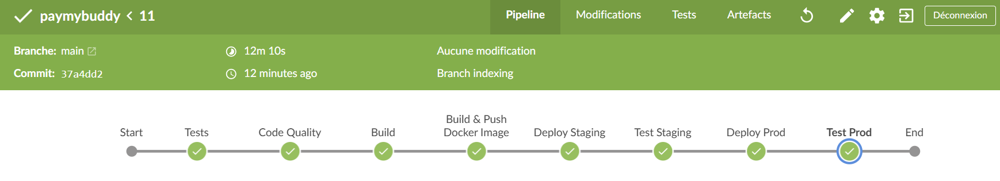
</p>

<p align="center">
  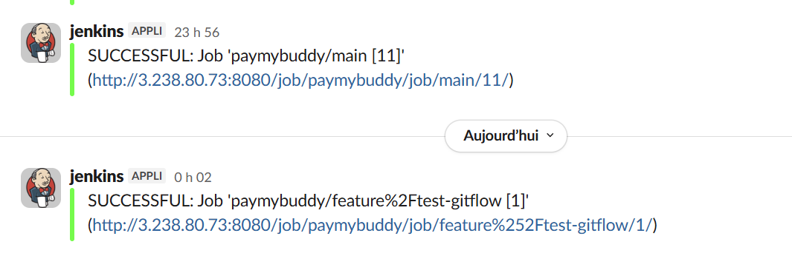
</p>

<p align="center">
  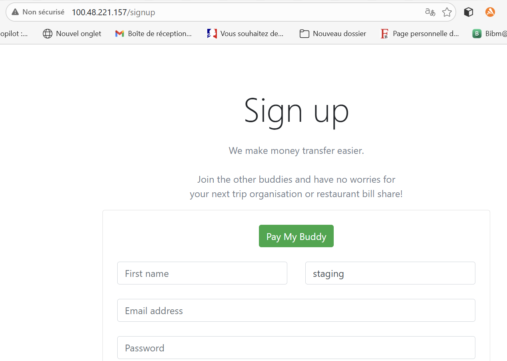
</p>

<p align="center">
  
</p>

<p align="center">
  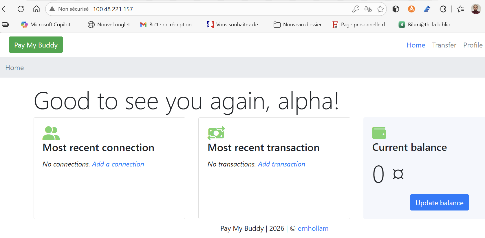
</p>

<p align="center">
  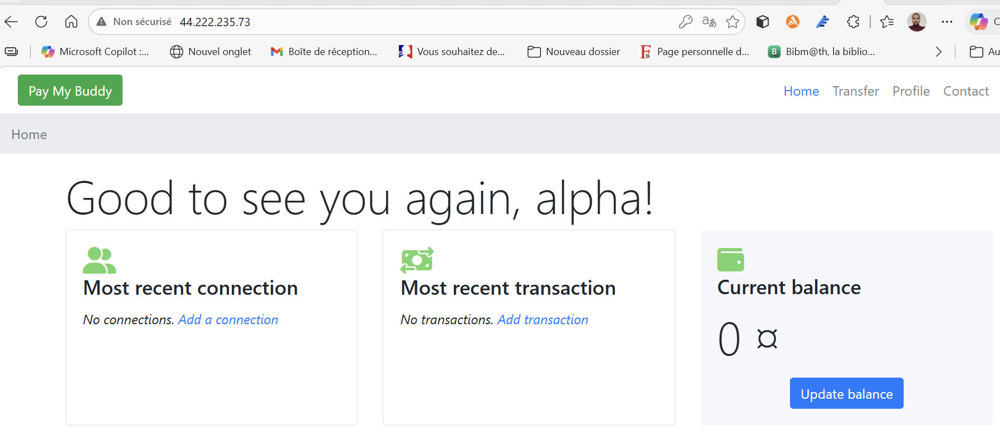
</p>

<p align="center">
  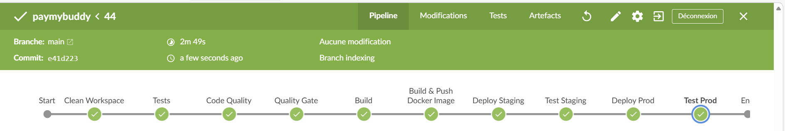
</p>

<p align="center">
  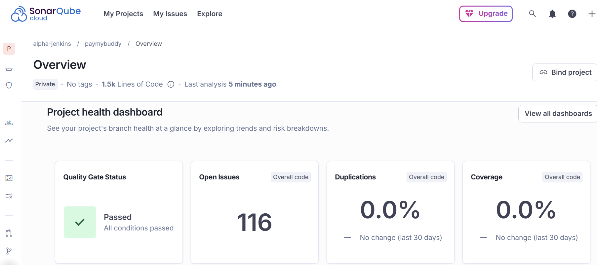
</p>

<p align="center">
  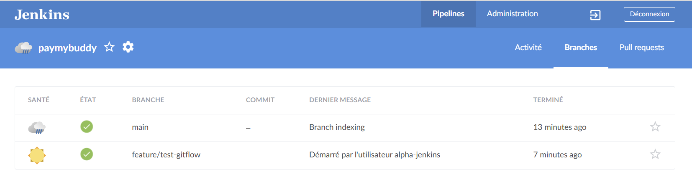
</p>

<p align="center">
  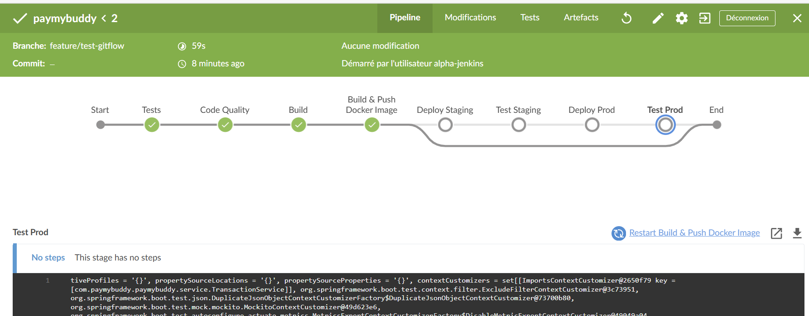
</p>

<p align="center">
  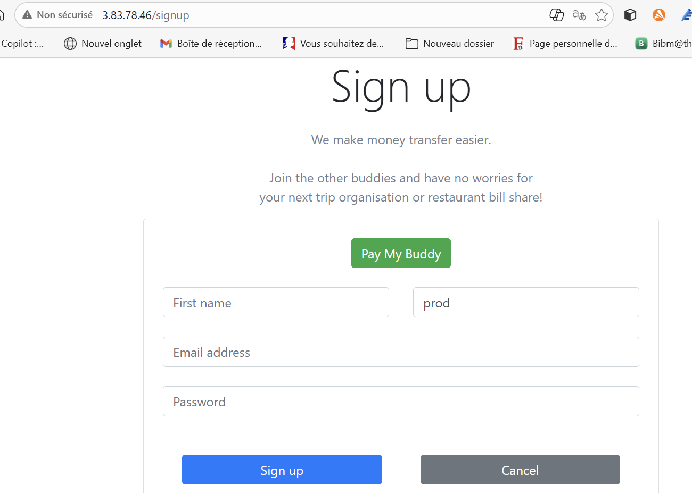
</p>
